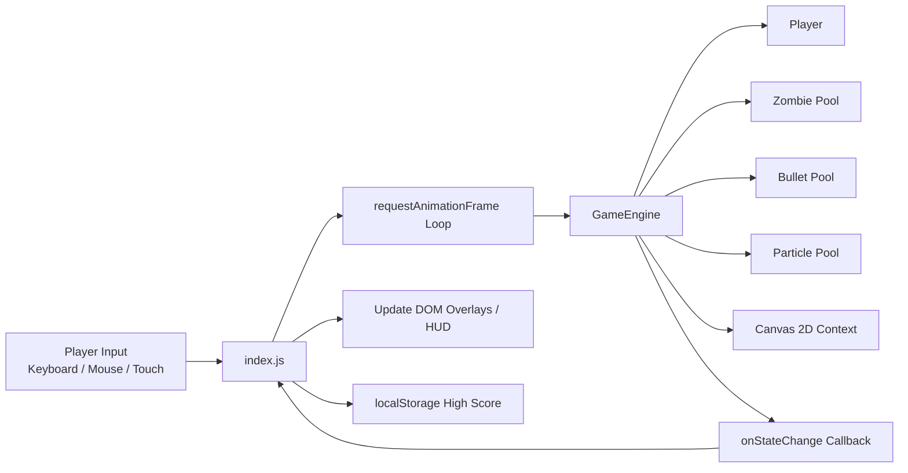
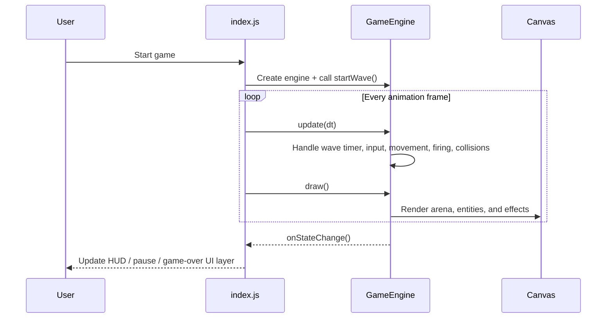

# DEAD ZONE: SURVIVAL ARENA

A fast-paced top-down zombie survival shooter built with pure HTML, CSS, and Vanilla JavaScript. Survive escalating waves with unlimited automatic fire and push for a persistent local high score in a neon-drenched arena.

## Live Demo

Play it here: [https://dead-zone-nine.vercel.app/](https://dead-zone-nine.vercel.app/)

## Overview

`DEAD ZONE: SURVIVAL ARENA` uses a lightweight, dependency-free front-end architecture:

- `index.html` and `index.css` handle the menus, overlays, HUD, and layout.
- `index.js` drives the DOM state, interactions, and overlays.
- A dedicated canvas `GameEngine` runs the simulation, collision checks, spawning, and rendering.
- Gameplay tuning lives in central constants so balancing is easy to adjust.

The result is a clean, lightning-fast application with zero transpilation overhead.

## Features

- Wave-based survival with a 3-second pre-wave countdown
- Three zombie archetypes: `WALKER`, `RUNNER`, and `BRUTE`
- Boss-style escalation every 5th wave
- Continuous shooting while holding the mouse button
- Unlimited bullets with no reload downtime
- Invincibility frames, hit flashes, particle bursts, and screen shake
- Keyboard, mouse, and touch input support
- Persistent high score saved in browser `localStorage`
- Responsive HUD and animated start, pause, and game-over overlays built with pure CSS and JS

## Controls

| Action | Input |
| --- | --- |
| Move | `WASD` or arrow keys |
| Aim | Mouse movement |
| Shoot | Hold left mouse button |
| Pause | `Esc` |
| Mobile play | Tap to fire, drag to move/aim |

## Tech Stack

| Layer | Technology | Role |
| --- | --- | --- |
| App shell | HTML5 | Structure and layout for the HUD and overlays |
| Language | Vanilla JavaScript | Drives UI logic and powers the game engine |
| Bundler | Vite 6 | Local dev server and production build (no JSX/TS plugins needed) |
| Styling | Pure CSS | HUD layout, overlays, tactical borders, and scanline animations |
| Rendering | HTML5 Canvas 2D | Arena rendering and frame-by-frame gameplay |
| Persistence | `localStorage` | Stores the best score locally |

## Architecture

The game loop is intentionally kept separate from the DOM bindings. `index.js` handles DOM manipulation and UI visibility updates only when the engine reports changes through a callback. That keeps rendering responsive while avoiding unnecessary DOM reflows on every frame.



### Runtime Flow



## Project Structure

```text
.
|-- index.html
|-- package.json
|-- vite.config.js
`-- src
    |-- index.css
    |-- index.js
    `-- game
        |-- constants.js
        |-- engine.js
        `-- entities.js
```

## Code Map

| File | Responsibility |
| --- | --- |
| `index.html` | App document structure and DOM layout |
| `src/index.js` | Canvas mounting, animation loop, DOM interaction, handling local high score |
| `src/game/engine.js` | Core simulation, input handling, waves, collisions, rendering |
| `src/game/entities.js` | `Player`, `Zombie`, `Bullet`, and `Particle` classes |
| `src/game/constants.js` | Arena size, player stats, fire rate, and zombie configs |
| `src/index.css` | Visual themes, scanlines, fonts, and tactical panel utility classes |

## Gameplay Systems

### Wave Progression

- Each new wave starts with a countdown before combat begins.
- Enemy count scales with `5 + (wave - 1) * 3`.
- Spawn speed increases as waves go up.
- Every 5th wave ends with a boosted brute-style boss enemy.

### Combat Rules

- The player starts with `100` HP.
- The primary weapon has unlimited bullets and fires continuously while the left mouse button is held.
- Bullets deal flat damage and deactivate on impact or when leaving the arena.
- Zombies damage the player on contact, then invincibility frames prevent immediate repeated hits.

### Performance-Oriented Design

- Bullets, zombies, and particles are preallocated into pools.
- The engine updates and draws only active entities.
- DOM updates only occur when necessary (e.g. `onStateChange` callbacks).

## Local Development

### Prerequisites

- Node.js
- npm

### Run Locally

```bash
npm install
npm run dev
```

Open `http://localhost:3000`.

### Useful Scripts

| Command | Purpose |
| --- | --- |
| `npm run dev` | Start the Vite dev server |
| `npm run build` | Create a production build in `dist/` |
| `npm run preview` | Preview the production build locally |

## Build and Deploy

This project currently ships as a static front-end app. After running:

```bash
npm run build
```

the generated `dist/` folder can be deployed to any static host, including Vercel, Netlify, GitHub Pages, or a traditional CDN-backed web server.

Current Vercel deployment: [https://dead-zone-nine.vercel.app/](https://dead-zone-nine.vercel.app/)

## Balancing and Customization

If you want to tune the feel of the game, these are the highest-value files:

- `src/game/constants.js`: canvas size, fire rate, movement speed, zombie stats
- `src/game/engine.js`: wave scaling, boss logic, spawn timing, collision behavior
- `src/index.js`: HUD update logic, overlays, local storage key
- `src/index.css`: visual theme, scanlines, fonts, and tactical panel styling

## Why This Project Is Easy To Extend

The current structure is a strong base for adding:

- new weapons and fire patterns
- pickups and temporary buffs
- enemy AI variants
- audio effects and music
- mobile-specific controls
- scoreboards or online progression

Because the engine, entities, constants, and HTML shell are already separated cleanly, new systems can be added rapidly without digging through complex abstraction layers.
